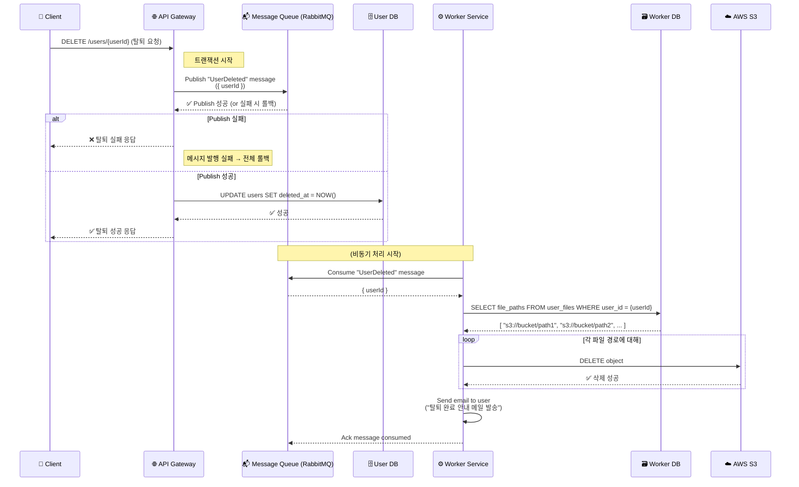

# 프로젝트 설정 및 실행 방법

Docker Compose 실행 방법

```bash
docker-compose up -d 
```

테스트코드 실행방법

```bash
npm run test 
```

# 사용된 기술 스택 및 라이브러리

TypeScript, NestJS, RabbitMQ 

# 설계 결정 이유 

Event-driven microservices 를 적용하기로 결정했습니다. 

# 문제 해결 과정 및 고민 

user DB, worker DB 를 분리할까 하나로 할까를 고민했습니다.
DB 에 비동기 처리에 대한 칼럼을 만들고 worker 에서 DB 를 조회하고 MQ 와 sync 를 맞추는 방향에 대해 고민하다 적용하지 않았습니다. 

# 비동기 처리 설명 

사용자 탈퇴 요청 시, API Gateway가 메시지 큐(RabbitMQ)에 이벤트를 발행하고,  
Worker Service가 비동기로 이메일 발송 및 S3 파일 삭제를 수행하는 구조입니다.

---

### 🧭 전체 시퀀스 다이어그램




*설계한 시퀀스를 설명하여 mermaid 작성을 Prompt 를 활용했습니다. 

# 테스트 전략 

통합 테스트 작성했습니다. 